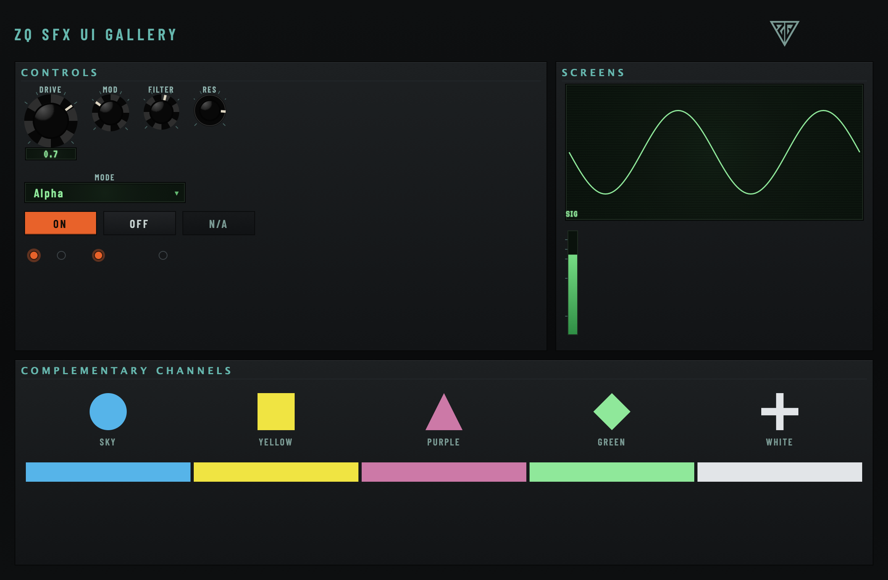

# zqsfx_ui

The shared ZQ SFX house UI: design tokens, a `LookAndFeel`, and a set of bound controls
(`Knob`, `Combo`, `LitToggle`, `TextToggle`, `Led`, `PhosphorScreen`, `PeakMeter`,
`LogoMark`) used by every ZQ SFX JUCE product so they read as one family - the same
dark chassis, type, readouts, control behaviour, and accessibility floor. It is a
design system, not a literal skin: decoration that makes a specific product what it is
(Broken's grime, screws, chipped knobs) stays with that product.



This module was lifted from Broken (`Project_TurboSynth`), the house's original design
baseline. `docs/ZQSFX_UI_STYLE_GUIDE.md` in the workspace this module was extracted
from is the spec of record for the values below.

## Consuming it (FetchContent)

Add JUCE first, then this module. It must come **after** JUCE is available, so its
CMakeLists can detect an existing `juce::juce_gui_basics` target and skip fetching its
own copy:

```cmake
include (FetchContent)

FetchContent_Declare (JUCE
    GIT_REPOSITORY https://github.com/juce-framework/JUCE.git
    GIT_TAG 8.0.6
    GIT_SHALLOW TRUE)
FetchContent_MakeAvailable (JUCE)

FetchContent_Declare (zqsfx_ui
    GIT_REPOSITORY https://github.com/themightyzq/zqsfx_ui.git
    GIT_TAG v0.1.1
    GIT_SHALLOW TRUE)
FetchContent_MakeAvailable (zqsfx_ui)

target_link_libraries (YourPlugin PRIVATE zqsfx::zqsfx_ui)
```

## Link target name

**`zqsfx::zqsfx_ui`** is the target name to depend on (an alias to `zqsfx::ui` also
exists and points at the identical library, but `zqsfx::zqsfx_ui` is the one to write
in new CMakeLists, since it is what `juce_add_module`'s `ALIAS_NAMESPACE zqsfx` always
produces for a module whose `ID` is `zqsfx_ui`). Linking it also pulls in the embedded
fonts and JUCE's recommended config/warning flags - no extra CMake steps.

## Usage example

```cpp
// PluginEditor.h
zqsfx::ui::LookAndFeel lookAndFeel;

// PluginEditor.cpp
MyEditor::MyEditor (MyProcessor& p) : AudioProcessorEditor (p)
{
    juce::LookAndFeel::setDefaultLookAndFeel (&lookAndFeel);

    // A rotary knob bound to an APVTS parameter, with a value readout.
    driveKnob = std::make_unique<zqsfx::ui::Knob> (
        p.apvts, "drive", "DRIVE", "Drive amount.", /*big*/ true);
    addAndMakeVisible (*driveKnob);

    // The company mark, wired as the About-box trigger.
    logo = std::make_unique<zqsfx::ui::LogoMark> ("My Product");
    logo->onClick = [this] { showAboutBox(); };
    addAndMakeVisible (*logo);

    setSize (900, 600);
}

MyEditor::~MyEditor()
{
    juce::LookAndFeel::setDefaultLookAndFeel (nullptr);
}
```

## Knobs

**The house knob is the filmstrip art Broken uses** (Analog Knob Kit 01 by Julian Behrens /
Noisehead, [vst-design.com](https://www.vst-design.com)). Its licence allows use and
modification inside commercial and non-commercial plugin projects, requires a credit in open
source projects, and forbids resale or **redistributing the images as a standalone design
resource**. A public UI library is exactly that, so **this repository does not contain the
strips.** Each product carries its own copy:

1. Put `strip_a.png`, `strip_b.png`, `strip_c.png` and `LICENSE-Noisehead-KnobKit.txt` in the
   product's `assets/knobs/`.
2. Credit Julian Behrens in the product's README and About box.
3. Embed and hand them over:

```cmake
zqsfx_ui_add_knob_strips (DIR assets/knobs TARGETS MyPlugin)   # after FetchContent_MakeAvailable (zqsfx_ui)
```

```cpp
#include "ZqsfxKnobStrips.h"
lookAndFeel.setKnobStripsFromMemory (ZqsfxKnobStrips::strip_a_png, ZqsfxKnobStrips::strip_a_pngSize,
                                     ZqsfxKnobStrips::strip_b_png, ZqsfxKnobStrips::strip_b_pngSize,
                                     ZqsfxKnobStrips::strip_c_png, ZqsfxKnobStrips::strip_c_pngSize);
// per-slider override, if a knob needs a specific strip regardless of its size:
knob.slider.getProperties().set ("zqsfxStrip", "xl"); // "xl" / "m" / "s"
```

Strip choice is by dial size: 56 px and up uses `strip_a` (scalloped), 42 px and up `strip_b`
(stripe), smaller `strip_c` (metal cap). The three strips total about 6.9 MB per binary; a
product that only uses small dials can pass an empty `juce::Image` for the sizes it never draws.

Without strips the LookAndFeel falls back to a plain **vector knob**, so a control is never
invisible. The gallery in this repository shows that fallback, because the art cannot live here.

Section titles on `Panel` are drawn in the platform bold face, wide-tracked (the house
decision, and how Broken has always looked); labels and buttons use Barlow Condensed.

## Tokens

`zqsfx::ui::colour`, `zqsfx::ui::gradients`, and `zqsfx::ui::geom` (in
`zqsfx_ui/tokens/Tokens.h`) hold the base palette, gradients, and geometry constants.
Their values are byte-identical to Broken's `Theme.h` - this module never "improves" a
colour. See `docs/ZQSFX_UI_STYLE_GUIDE.md` sections 2 and 6 in the workspace this
module was extracted from for what each token means and where it is used.

## Complementary channels

`zqsfx::ui::comp` holds five colour-blind-safe channel colours (`sky`, `yellow`,
`purple`, `green`, `white`) for products that need to show several categories at once
(Unravel's tonal/transient/noise, LFlOw's lanes, SK4n's oscillators, and so on):

- **Five is the ceiling.** A sixth hue drops the worst-case separation below what is
  reliably distinguishable for colour-blind users; a product needing more than five
  categories encodes the rest by shape, pattern, or position instead.
- **Colour is never the only signal.** Pair every channel with a label, shape, or
  position too (see the demo gallery's "COMPLEMENTARY CHANNELS" panel: each swatch has
  a distinct marker shape as well as a colour).
- Assign channels in table order (`comp::all`, or `comp::channel(index)`), so a
  3-channel product uses `sky`, `yellow`, `purple`.
- No red channel (red means clip/error) and no orange channel (orange is `accent`,
  meaning active).

## Accessibility floor

1. Every interactive control has an accessible title (`setTitle`), a tooltip, a
   description, and help text. `Knob`, `Combo`, `LitToggle`, and `TextToggle` all set
   these on their inner control automatically.
2. Keyboard focus is always visible: a 2 px `colour::accent` ring via
   `LookAndFeel::createFocusOutlineForComponent` (`geom::focusRingPx`).
3. Text meets WCAG AA (4.5:1) at the size it is drawn - verified by `TokenTests`.
4. Hit targets are at least `geom::minHitTargetPx` (22 px).
5. Colour never carries meaning alone (see "Complementary channels" above).

## Building the gallery, running the snapshot tool and tests

```bash
cmake -S . -B build -DCMAKE_BUILD_TYPE=Release
cmake --build build -j 8

# interactive gallery app
open build/ZqsfxUiDemo_artefacts/ZQ\ SFX\ UI\ Gallery.app     # macOS; path varies per platform

# headless PNG renderer (writes snapshots/gallery.png and snapshots/gallery_disabled.png
# next to wherever you point it)
./build/ZqsfxUiSnapshot_artefacts/ZqsfxUiSnapshot snapshots/gallery.png

# console token tests
ctest --test-dir build --output-on-failure
```

`ZQSFX_UI_BUILD_DEMO` is `ON` when this repository is built directly (top-level) and
`OFF` when a product pulls it in via `FetchContent`, so a product's own build never
also compiles the gallery app, snapshot tool, or tests.

## Licence

GPL-3.0-or-later (see `LICENSE`), matching every ZQ SFX product that links JUCE's free
tier. The embedded fonts (Barlow Condensed, VT323, IBM Plex Mono) are licensed under
the SIL Open Font License; their licence texts ship alongside them in
`assets/fonts/OFL-*.txt`.

## Versioning

Semantic versioning. Token **values** only change in a major version - a product
pinning a tag can rely on `colour`/`comp`/`geom` never shifting under it within the
same major version. New tokens, new components, and behavioural additions are minor
versions; bug fixes are patch versions.
